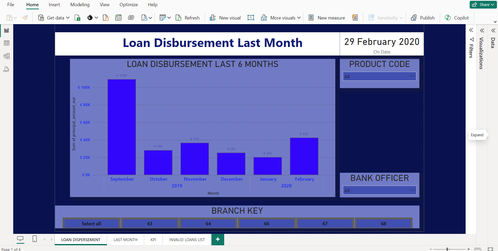
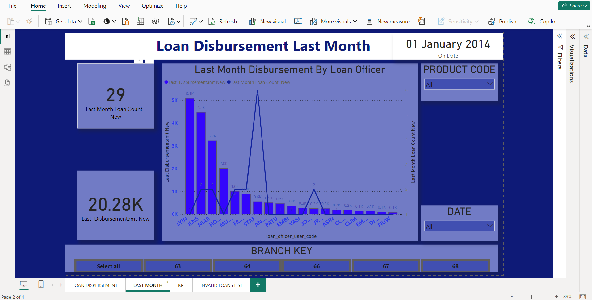
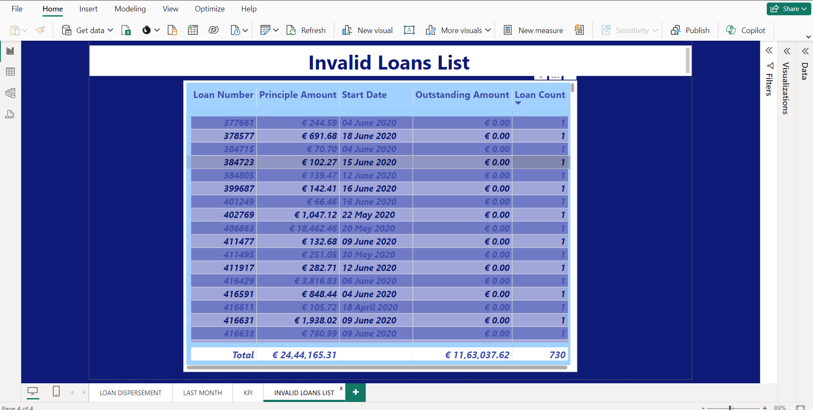

# Power BI Loan Disbursement Analysis Dashboard

## Description

The Power BI Loan Disbursement Analysis Dashboard provides insights into loan disbursement trends and performance metrics. It consolidates data from multiple sources to visualize key indicators such as loan approval rates, disbursement amounts over time, loan category and more. This dashboard aims to help stakeholders (like financial analysts, managers, or decision-makers) gain a comprehensive understanding of the loan disbursement process and identify areas for optimization.

## Key Features

- Visualize loan disbursement trends and patterns.
- Track loan approval rates and disbursement amounts.
- Drill-down capabilities for detailed insights.
- Interactive filters and slicers for customized views.

## Usage Instructions

To view the Power BI Loan Disbursement Analysis Dashboard:
1. Download and install [Power BI Desktop](https://powerbi.microsoft.com/desktop/) if you haven’t already.
2. Clone or download the repository to your local machine.
3. Open the `.pbix` file using Power BI Desktop.
4. Navigate through different pages and interact with slicers and filters to explore various aspects of loan disbursement data.

## Screenshots

## Additional Notes

- Ensure that your Power BI Desktop is updated to the latest version for optimal performance.
- Customize visuals and insights based on specific business requirements by modifying the Power BI report.

